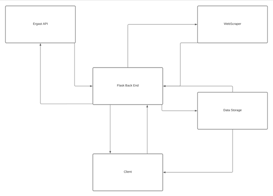
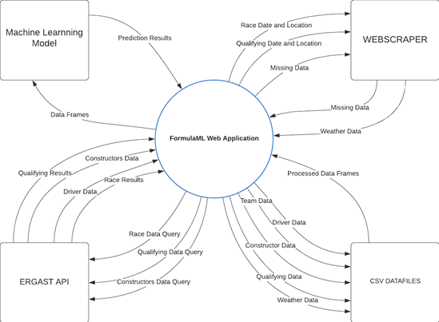
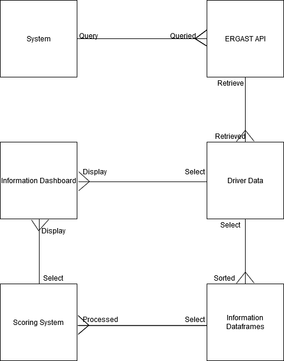
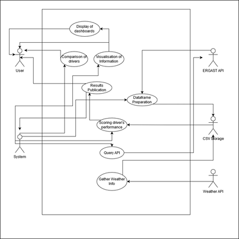
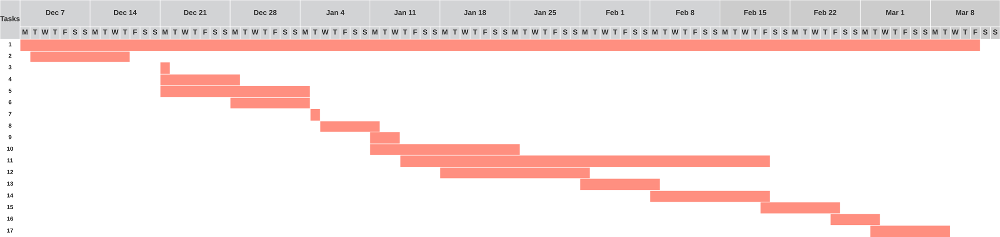

# **Functional Specification - *FormulaML***

## Group Members

  + Kealan O'Connor 
  + Peter Browne 
  

# **Table of contents**

 **1. Introduction**  
      
 - [1.1 Overview](#11-overview)
    
 - [1.2 Business Context](#12-business-context)
    
 - [1.3 Glossary](#13-glossary)

 **2. General Description**

 - [2.1 Product / System Functions](#21-product-system-functions)

 - [2.2 User Characteristics and Objectives](#22-user-characteristic-and-objectives)

 - [2.3 Operational Scenarios](#23-operational-scenarios)

 - [2.4 Constraints](#24-constraints)

 **3. Functional Requirements**

 - [3.1 Data Gathering](#31-data-gathering)

 - [3.2 DataFrame Merging](#32-dataframe-merging)

 - [3.3 Regression Precision Scoring](#33-regression-precision-scoring)

 - [3.4 Data Modelling](#34-data-modelling)

 - [3.5 Visualisation of Data](#35-visualisation-of-data)

 - [3.6 Dashboard Selection](#36-dashboard-selection)

 - [3.7 Interacting with Race Predictions](#37-interacting-with-race-predctions)

 - [3.8 Interacting with Driver Statistics](#38-interacting-with-driver-statistics)

 - [3.9 Interacting with Season Statistics](#39-interacting-with-season-statistics)

 - [3.10 Interacting with Track Statistics](#310-interacting-with-track-statistics)

 - [3.11 Interacting with Team Statistics](#311-interacting-with-team-statistics)

**4. System Architecture**

 - [4.1 System Architecture Diagram](#41-system-architecture-diagram)

**5. High-Level Design**

 - [5.1 Data Flow Diagram](#51-data-flow-diagram)

 - [5.2 Logical Diagram](#52-logical-diagram)

 - [5.3 Use Case Diagram](#53-use-case-diagram)

**6. Preliminary Schedule**

 - [6.1 Task List](#61-task-list)

 - [6.2 Gantt Chart](#62-gantt-chart)

[**7. Appendices**](#7-appendices)

# **1. Introduction**

## 1.1 Overview

Our project is a web application we are calling FormulaML. This Application is designed to be a unique and accessible tool for Formula 1 fans both casual and hardcore by providing them with a hub of information and statistics on everything from drivers, teams, contsructors, race tracks, championship history and much more. Our primary feature however is not just a repository of data on Formula 1, but a demonstration of how powerful all this data can be by applying it to our own regression based machine learning analysis that will break down all of our data and will attempt to predict the outcome of race.

Our objective is to allow even most casual fans of the sport to think like a Formula 1 team and predict the outcome and strategy of a race like they do. Formula 1 is often referred to as the pinnacle of motorsport and this isn't an inaccurate assessment. It is one of the largest and most popular sports in the world, featuring some of the biggest names in the Automotive and Technology industries such as Ferrari, Mercedes and Renault. The sport is also one of the most technical sports there is, featuring budgets of up to 600 million per year and some of the highest paid athletes in the world. All of this is done with the goal of creating the fastest and most advanced cars in the world, and pushing the limits a machine and driver can do. Races are won and lost by the millisecond and because of this every minute detail matters. As such, teams must have data on everything and take every detail into account, even something as small as how aerodynamic the paint job is.

This can paint a daunting and overwhelming picture for new fans discovering the sport with so much information and factors to take into account. However thanks to the FIAs meticulous records and policy of total transparency, vast quantities of records and data is open and available to the public dating all the way back to the first championship in 1947. This forms the basis of our project. We seek to gather all the data we can using an open source API called ERGAST, which will allow us to access the FIAs archives. With this data we can help bridge the gap between casual fans and the teams themselves by presenting them with the data we have gathered in a way that is easily understood and meaningful and to demonstrate how all these factors come into play with our predictive model.

Upon accessing our web application, users will have access to pages and profiles of each driver, team and track in the 2020 season, featuring the most important information and statistics on the current performance and history of each driver and team. Users will also be able to see graphs visualising data we've gathered in a way that is easy to understand and approach but also informative. One example of this would be a graph showing the correlation between a driver's age and their performance or the psychological impact racing in your home country may have. The model will also update itself with new data in real time when new information becomes available after each race and qualifying session in order to predict the upcoming race with the most recent and relevant data.

Users will also be able to access the results of our primary feature and goal, our predictive machine learning model. Our aim is to allow users to select the each race they wish to see the prediction for and be presented with graphs they can interact with showing the predicted outcome of the race and the chances of that prediction. The users will also be able to select a specific driver and see the chances of them finishing in each position.
Accompanying this will be a breakdown and explanation of how the model works in order to help users understand how we came to these conclusions and what data was used to help make the prediction, this will be done with the aim of maintaining transparency with our users and to ensure that the users can trust the information is built on a solid foundation and backed up by real data.

## 1.2 Business Context

The primary goal of this project is not to make money however that does not mean it could not be used in a commercial setting or for that purpose. For example:

- Sports Journalists may use an application like this, specifically our machine learning model, in order to try to make more accurate predictions of how a race will go or the general performance of a driver when trying to assess how a drivers contract negotiations with teams may go.

- Betting Agencies or people looking to make a bet would find a tool like this invaluable for predicting the odds of a specific result, especially with a sport as technical and complex as this.

- Due to the nature of the webapp being something users will regularly refer back to, the type of traffic it would create is perfect for advertising and an income could be acquired this way.

## 1.3 Glossary

- **ERGAST API** : An Open-Source API used to access the FIA archives for data on Formula 1.
- **FIA** : The Federation Internationale de l'Automobile is the Official Governing Body for International motorsport.
- **Flask** : A python based web application framework.
- **Web Scraper** : An API or tool used to extract information from the HTML of a website.
- **Regression** : A statistical method that is used to determine the strenght of the relationship between one varibale and a series of other variables.
- **Machine Learning:** : Machine learning is a method of data analysis that automates analytical model building. It is a branch of artificial intelligence based on the idea that systems can learn from data, identify patterns and make decisions with minimal human intervention.
- **CSV Data** : CSV is a file format used to store large ammounts of tabular data, often used to store data for spreadsheets.
- **Precision Scoring** : A fucntion used to determine the ratio of correctly predicted positive observations to the total predicted positive observations. Used in training and testing a predictive model.

# **2. General Description**

## 2.1 Product / System Functions

Listed below are the primary functions we plan to implement into our web app, some of these functions may change or be removed and some may be added during the course of development, however this list is what is currently planned. 

- Query ERGAST API for data- Login (and Password Reset).
- Gather historical weather from API
- Data frame preparation and conversion
- Regression scoring system
- Machine learning modelling
- Publish results
- Comparison of drivers
- Real time Driver tracking
- Visualisation of select information
- Display of driver dashboard
- Display of race dashboard
- Display of season dashboard
- Display of track dashboard
- Display of team dashboard

## 2.2 User Characteristics and Objectives

The web app is designed for fans of Formula 1 who want to try to understand the sport better. We plan to give fans the ability to judge drivers by other metrics and not just by their race results. As well as the comparison tool, we also aim to show graphs and visualisations of data that would be unavailable to the average Formula 1 fan. 

The web app will be designed with usability and ease of access at its core, users will be able to find the data or information they need with as few clicks as possible. Not all users will have an in-depth knowledge of the sport or technical ability, because of this we must formulate our data in a way that is accommodating but also powerful to all types of users. 

## 2.3 Operational Scenarios

Our system primarily has two types of users, our system itself interacting with the APIs on the backend, and human visitors interacting with the web app on the front end. For the purpose of the following operational scenarios we will refer to them as System and Visitor.

**System query’s API for data**

The System will send a HTTP request to the ERGAST API, which will then search the ERGAST database for our requested data and send it to us in either XML or JSON format. We will then convert the responses into CSV data frames. This will be done for the different types of data that we require such as races, drivers, seasons, tracks, teams, and the weather from the day of the race.
**System merges and prepares data frames**

At this stage the System will have thus far gathered six data frames. In this step we will take the necessary information from the data we have gathered and merge that into a singular data frame to be used by our machine learning model which will then train the neural network to give us the results we require.

**Data is computed and analysed**

Once the relevant data has been sent to the machine learning model, it is then computed using regression algorithms which score the drivers. This will then give us our output, which will be our predictions for race outcomes and ratings for drivers.

**User views prediction**

The User can navigate to the prediction dashboard using the indicated button to be brought to the page. Once on the page, the user can then use a dropdown to select a race that they want to see the prediction for. The User will be able to interact with the graph that displays the results. The User will also be given a breakdown on how the information and ratings were made/gotten.

**User interaction with dashboards**

The User will also be able to interact with the other dashboards that display the driver, race, season, track and team information. Within these dashboards the User will be able to see and interact with graphs and tables that display a wide range of information about all of the different topics.

## 2.4 Constraints

- **Time constraint** : Time is by far going to be the greatest constraint we face as the complexity of our analysis is not yet known, due to the quantity of information we need to process and analyse. The user experience will be designed with scalability in mind and can be expanded depending on time.
- **Internet Constraint:** Internet will be required by the user to view and use the web app.
- **Hardware Constraint:** Hardware constraints may prove to be larger than expected, due to the unknown algorithm complexity of our machine learning model and data processing, the hardware we are using for the development of this project may struggle to compute the data we have gathered in a timely manner.
- **API Rate Limit Constraint:** API rate limit constraints may cause issues. Due to the sheer quantity of data we aim to gather, we will have to put measures in place to prevent excessive amounts of data requests which may cause us to be locked out from our APIs due of rate limits.
- **Remote Developmetn Constraint:** Remote development presents a number of constraints for us, as we cannot physically interact with each other, or our supervisor. While we have measures in place to streamline the process, distance will always cause issues while dealing with problems and may cause development delays. 

# **3. Functional Requirements**

## **3.1 Data Gathering**

* Description 

  This is the first step in the functionality of our machine learning analysis which will be used to make our predictions. In order to make accurate predictions we will require a lot of data, thankfully we have access to the ERGAST API. This API will allow us to access the FIA archives dating back over 70 years and will get us most of the information we need. The data we gather will be broken up into 6 data frames which will gather all the information we need, these data frames will be: Qualifying results, Race Results, Drivers Championship Standings, Constructors Standings and Finally weather. In order to do this our system will query the API for specific keys and parameters depending on the data frame which will then be formatted into a HTTP request as per REST standards. The API will then return the information we need from its database in either JSON or XML format which can then be processed into CSV files for easier access.

* Criticality

  This function is the most critical of our entire project as the information gathered in this step forms the basis of every function of the app, not just the Machine Learning model. Even without the Regression analysis the information we gather at this stage will allow us to get all the statistics we need to create each of our dashboards and create visualisations and comparisons of the basic data. For example even just taking drivers' ages along with their career performance data we can use scatter plots to examine the correlation between age and performance or the psychological impacts of age on their performance.

* Technical issues

  For the majority of our data frames this step should be straightforward, the exceptions are qualifying and weather. These two data sets will require more work, for qualifying, issues will arise as the rules and format of qualifying in Formula 1 has changed drastically over the years so the data we get will require some adjustments to make it all fit together and remain relevant. Weather on the other hand is not recorded by ERGAST at all but it plays a big role in the outcome of a race and so we must find another way of getting historical weather data. Our current plan is to use a web scraper to search through the wikipedia page for each race as these contain information on weather.

* Dependencies with other requirements

  None.

## **3.2  DataFrame Merging**

* Description 

  So far our six data frames will have provided us with all the information we need and more, the next step is to look at the data we have and see which sets are valuable and which ones are not and then merge them all together into one large data frame that will then be used by later functions. For example, both qualifying data and race data will both give us driver names, nationality, age and their results. This data should be easy to merge as they contain many common keys. The rest of the frames will follow the same process, we will look through and find common keys, merge those and then select any other sets that we believe are important. Other less useful information will not be merged.

* Criticality

  This feature is vital for the later stages of our analysis as it will gather all the data we have so far and sort it in a way that will make it much easier to analyze. The analysis could still be conducted without this step being done but it would require much more work and we could end up with a lot of duplicate data which may affect the outcome of the prediction.

* Technical issues

  Provided the previous step in gathering information was completed as planned we do not foresee any particular technical issues arising for this particular function.

* Dependencies with other requirements

  This function, along with most functions within the webapp and particularly the prediction model aspect, is entirely dependent on successfully gathering the data.

## **3.3 Regression Precision Scoring**

* Description 

  This Function will coincide with our regression model and will be used to help define the desired outcome and train the model in order to ensure a higher precision score. The basic methodology is that the model will make a prediction for a particular position for example the winner, and will then output the results. The driver which the model predicts to be the most likely winner will be marked by a boolean value which is then checked alongside the actual race result value when training the model. For example if the model predicts that Lewis Hamilton will finish in first place whereas the actual result for that race was that his teammate Valtteri Bottas won, then the model will receive a lower precision score and vice versa.

* Criticality

  This function will be crucial in training and assessing the precision of our algorithm and prediction and without it there is no way to teach the model which factors and variables to value higher than others and the predictions wont make sense.

* Technical issues

  This method may be difficult to implement due to the potential complexity of the model and its predictions. There are a number of methods you can use to create this function and it will be a matter of testing to see which one fits best with our model once it is in place.

* Dependencies with other requirements

  This method will require our predictive models output in order to be functional.

## **3.4 Data Modelling**

* Description 

  This function will be responsible for using the data frame and the data in it as input for our Regression Algorithms which will be implemented using the Scikit-learn library for python. The output will be the Algorithms predictions which will then be validated and scored by our Scoring function form the previous requirement.

* Criticality

  This function will act as the centerpiece for our project web app and as such it is critical to our overall goals for this project.

* Technical issues

  We believe that this will be the most technically complex part of the project both in terms of time complexity and programming complexity but we are prepared for this and have allocated this function the most amount of time to develop in order to ensure it is implemented to a high standard.

* Dependencies with other requirements

  This function will be dependent on all of the functions we have outlined thus far, our data gathering, data frame processing and precision scoring.

## **3.5 Visualisation of Data**

* Description 

  This functionality allows the user to see the data they wish to see in a clear and visually pleasing way. Depending on what type of information the user is looking for, they can find multiple graphs and tables displaying the information to them in a clear, concise and approachable way. 

* Criticality

  This is a key function of our web app. Aspects of this functionality will be found on almost all pages of the web app. 

* Technical issues

  For some data that we aim to visualise, such as our predictions/results, drivers who haven’t taken part in a race to that stage might cause some issues due to having no Formula 1 results to base their performance from.

* Dependencies with other requirements

  Dependencies with other requirements This function requires the user to have navigated to a dashboard with graphs and tables to be visualised. It also relies on INSERT HERE as well for us to show the graphs.

## **3.6 Dashboard Selection**

* Description 

  When on any page or dashboard of the web app, the user can use dropdowns found at the top of the page in order to navigate the site and find the information they are looking for. Once they have navigated to the correct dashboard, they can find their way back to the home page by clicking the “Home” button.

* Criticality

  Selecting a dashboard is again a key function of the web app. Without being able to navigate there is no way for a user to reliably find the information they desire.

* Technical issues

  Selecting a dashboard is again a key function of the web app. Without being able to navigate there is no way for a user to reliably find the information they desire.

* Dependencies with other requirements

  The information for the dashboards will be taken and interpreted from the ERGAST API to give us as much information as possible to show our users.

## **3.7 Interacting with Race predictions**

* Description 

  When viewing our race predictions, the user can interact with the graphs and tables we provide to see the specific predictions they want to see with regards to changing variables like, the track, and weather. The user will also be able to see a breakdown on how the information has been gathered so that they can know the information has numbers, and real data behind it and is not just assumed.

* Criticality

  This is a crucial part of the functionality of our web app as we aim for this system to be what separates the web app from anything that is similar to ours.

* Technical issues

  We have yet to decide, in full, what options will be available to the user when they are looking to select things to change on the graph they are looking at.

* Dependencies with other requirements

  Requires the predictions to be published from the machine learning model.

## **3.8 Interacting with Driver Statistics**

* Description 

  These dashboards and the stats they have will be updated with the most recent races and the driver’s most recent statistics. The user will be able to choose between season data, for drivers who are still currently racing, and historical data which will be static and focus on drivers who have retired from the sport.

* Criticality

  This function is essential to the web app, being able to see statistics and information about their favourite drivers will be very important to Formula 1 fans new and old, as the drivers are the largest focus of the sport.

* Technical issues

  None.

* Dependencies with other requirements

   Statistics and Data will be taken from our CSV data used by the prediciton model.

## **3.9 Interacting with Season Statistics**

* Description 

  These dashboards and the stats they have will be updated when season’s come to their conclusion and are therefore static. Users will be able to look at the statistics of every Formula 1 season and will be able to see graphs and tables to give them a better idea of how the season went, even if they were unable to watch it themselves.

* Criticality

  This function isn’t essential to the project however like the driver statistics, is good information to provide to our users who will be able to learn about seasons they may not have seen before or relive seasons they have seen.

* Technical issues
  
  None.

* Dependencies with other requirements

  Statistics and Data will be taken from our CSV data used by the prediciton model.

## **3.10 Interacting with Track Statistics**

* Description 

  The dashboards for track statistics, like length, location and years used, will be static and unchanged except for at the end of a season. The user can learn lots of useful information that will help them understand some of the decision’s teams make that are track specific. 

* Criticality

  This function isn’t critical but would greatly help our users learn about Formula 1 as the constant changing tracks and locations are the one of the most important parts of Formula 1. The characteristics of a track will heavily influece the strategy and aerodynamic philosophy the teams choose.

* Technical issues

  None.

* Dependencies with other requirements
  Statistics and Data will be taken from our CSV data used by the prediciton model.

## **3.11 Interacting with Team Statistics**

* Description 

  These dashboards will contain statistics for the current and former Formula 1 teams. The user will be able to see things like how many times the team has won certain awards and races, which drivers have driven for the team, as well as seeing how many times they have won either of the world championships.

* Criticality

  This function would be critical for users as understanding the streghts and weakness' of teams is just as important as understanding the drivers.

* Technical issues

  Many teams have gone through many different names throughout their history in sport and so their entries in our CSV will be under several different headings. We will have to do some work to work around this issue. 

* Dependencies with other requirements

  Statistics and Data will be taken from our CSV data used by the prediciton model.

## **4. System Architecture**
- 

  The diagram above demonstrates the current plan for the system architecture. The System is comprised of a Flask based back end that will host our Webapp. The system also interacts with a 3rd party open source API called ERGAST, this is used to gather all of our information and data and store it in CSV files. We will also be useing webscrapers to fill in any gaps in our data and to gather hsitorical weather data for previous f1 races which the ERGAST API does not provide. All of this information will be stored in CSV Format and will be procesed into DataFrames which will be analysised and used by our Machine Learning Model. On the clinet side the user will be able to view and interact with dashboards that will display statistics and visualisations of data gathered by the ERGAST API as well as the results of our Predicitons.

# **5. High-Level Design**

## 5.1 Data Flow Diagram

- 

## 5.2 Logical Diagram

- 

## 5.3 Use Case Diagram

- 

# **6. Preliminary Schedule**

## 6.1 Task List

- 

## 6.2 Gantt Chart

- 

# **7. Appendices**
