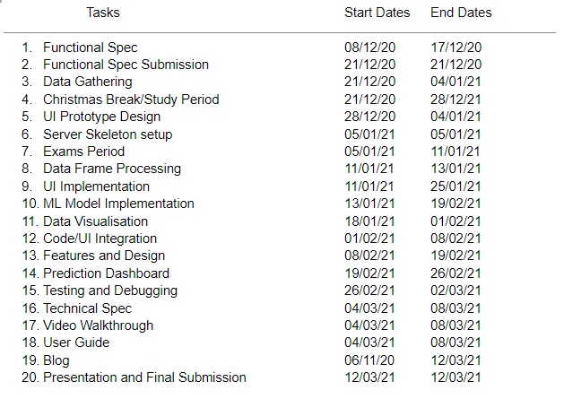

# **Functional Specification - *FormulaML***

## Group Members

  + Kealan O'Connor 
  + Peter Browne 
  

# **Table of contents**

 **1. Introduction**  
      
 - [1.1 Overview](#11-overview)
    
 - [1.2 Business Context](#12-business-context)
    
 - [1.3 Glossary](#13-glossary)

 **2. General Description**

 - [2.1 Product / System Functions](#21-product-system-functions)

 - [2.2 User Characteristics and Objectives](#22-user-characteristic-and-objectives)

 - [2.3 Operational Scenarios](#23-operational-scenarios)

 - [2.4 Constraints](#24-constraints)

 **3. Functional Requirements**

 - [3.1 Registeration](#31-registeration)

 - [3.2 Login](#32-login)

 - [3.3 Selecting User Instance](#33-selecting-user-instance)

 - [3.4 Profile](#34-profile)

 - [3.5 Creating a Trip Request](#35-creating-a-trip-request)

 - [3.6 Creating a Trip](#36-creating-a-trip)

 - [3.7 Searching for a Trip (Driver)](#37-searching-for-a-trip-driver)

 - [3.8 Searching for a Trip (Passenger)](#38-searching-for-a-trip-passenger)

 - [3.9 Requesting a Trip](#39-requesting-a-trip)

 - [3.10 Accepting a Request](#310-accepting-a-request)

 - [3.11 Trip Details](#311-trip-details)

 - [3.12 Starting a Journey](#312-starting-a-journey)

 - [3.13 Calculating Passenger Route](#313-calculating-passenger-route)

 - [3.14 Tracking the Driver](#313-tracking-the-driver)

 - [3.15 Messaging](#315-messaging)

 - [3.16 Rating System](#316-rating-system)

 - [3.17 Logout](#317-logout)

**4. System Architecture**

 - [4.1 System Architecture Diagram](#41-system-architecture-diagram)

**5. High-Level Design**

 - [5.1 Context Diagram](#51-context-diagram)

 - [5.2 Data Flow Diagram](#52-data-flow-diagram)

 - [5.3 Logical Diagram](#53-logical-diagram)

 - [5.4 Use Case Diagram](#54-use-case-diagram)

**6. Preliminary Schedule**

 - [6.1 Task List](#61-task-list)

 - [6.2 Gantt Diagram](#62-gantt-diagram)

[**7. Appendices**](#7-appendices)

# **1. Introduction**

## 1.1 Overview

Our project is a web application we are calling FormulaML. This Application is designed to be a unique and accessible tool for Formula 1 fans both casual and hardcore by providing them with a hub of information and statistics on everything from drivers, teams, contsructors, race tracks, championship history and much more. Our primary feature however is not just a repository of data on Formula 1, but a demonstration of how powerful all this data can be by applying it to our own regression based machine learning analysis that will break down all of our data and will attempt to predict the outcome of race.

Our objective is to allow even most casual fans of the sport to think like a Formula 1 team and predict the outcome and strategy of a race like they do. Formula 1 is often referred to as the pinnacle of motorsport and this isn't an inaccurate assessment. It is one of the largest and most popular sports in the world, featuring some of the biggest names in the Automotive and Technology industries such as Ferrari, Mercedes and Renault. The sport is also one of the most technical sports there is, featuring budgets of up to 600 million per year and some of the highest paid athletes in the world. All of this is done with the goal of creating the fastest and most advanced cars in the world, and pushing the limits a machine and driver can do. Races are won and lost by the millisecond and because of this every minute detail matters. As such, teams must have data on everything and take every detail into account, even something as small as how aerodynamic the paint job is.

This can paint a daunting and overwhelming picture for new fans discovering the sport with so much information and factors to take into account. However thanks to the FIAs meticulous records and policy of total transparency, vast quantities of records and data is open and available to the public dating all the way back to the first championship in 1947. This forms the basis of our project. We seek to gather all the data we can using an open source API called ERGAST, which will allow us to access the FIAs archives. With this data we can help bridge the gap between casual fans and the teams themselves by presenting them with the data we have gathered in a way that is easily understood and meaningful and to demonstrate how all these factors come into play with our predictive model.

Upon accessing our web application, users will have access to pages and profiles of each driver, team and track in the 2020 season, featuring the most important information and statistics on the current performance and history of each driver and team. Users will also be able to see graphs visualising data we've gathered in a way that is easy to understand and approach but also informative. One example of this would be a graph showing the correlation between a driver's age and their performance or the psychological impact racing in your home country may have. The model will also update itself with new data in real time when new information becomes available after each race and qualifying session in order to predict the upcoming race with the most recent and relevant data.

Users will also be able to access the results of our primary feature and goal, our predictive machine learning model. Our aim is to allow users to select the each race they wish to see the prediction for and be presented with graphs they can interact with showing the predicted outcome of the race and the chances of that prediction. The users will also be able to select a specific driver and see the chances of them finishing in each position.
Accompanying this will be a breakdown and explanation of how the model works in order to help users understand how we came to these conclusions and what data was used to help make the prediction, this will be done with the aim of maintaining transparency with our users and to ensure that the users can trust the information is built on a solid foundation and backed up by real data.

## 1.2 Business Context

The primary goal of this project is not to make money however that does not mean it could not be used in a commercial setting or for that purpose. For example:

- Sports Journalists may use an application like this, specifically our machine learning model, in order to try to make more accurate predictions of how a race will go or the general performance of a driver when trying to assess how a drivers contract negotiations with teams may go.

- Betting Agencies or people looking to make a bet would find a tool like this invaluable for predicting the odds of a specific result, especially with a sport as technical and complex as this.

- Due to the nature of the webapp being something users will regularly refer back to, the type of traffic it would create is perfect for advertising and an income could be acquired this way.

## 1.3 Glossary

- **Android OS** : Google's Linux-based open source operating system for mobile devices.
- **Android Studio:** The official integrated development environment for the Android application development.
- **Firebase** : is a cloud-based development platform owned by google, it acts as the server and provides tools in order to develop our app.
- **Google Maps API** : A service in order to enabled google maps within our application and allows for location markers too.
- **Geo-Fire** : GeoFire is an open-source library for Android that allows you to store and query a set of keys based on their geographic location using the Firebase realtime database.
- **Firebase Authentication:** A service that can authenticate our users using through email and passwords. When a new user signs up with an email, it sends a verification email to that address before storing to database. It handles sending password reset emails too.
- **Firebase Real-time Database:** No SQL, cloud hosted database that syncs and stores data across our app users within real time.
- **Google Play Services:** Required in order to use google APIs such as Google Maps within our app.
- **Place Autocomplete API:** A service that provide autocomplete functionality and predictions for string geographic searches
- **Google Directions API:** A service in which calculates directions between locations.
- **Firebase Cloud Storage:** FirebaseSDK to allow for the storage of user-generated content, such as photos.

# **2. General Description**

## 2.1 Product / System Functions

Displayed below are the main functions in which we plan to incorporate into our app, the functionality is subject to change over the course of development, however, for now this list is what we would like to feature. These functions will require a user to ,first, be registered successfully and have chosen their instance of user, as with our app having two types of user, each user to have different operations and permissions.

- Downloading the app and creating an account.
- Login (and Password Reset).
- Choosing an instance of user.
- Creating a trip.
- Creating a trip request.
- Requesting a trip.
- Viewing your trip(s).
- Starting a Journey.
- Real time Driver tracking
- Passenger(s) location and route automation.
- Rating System.
- User Profile.
- In-App messaging.
- Logging out.

## 2.2 User Characteristics and Objectives

The user community in which we plan to target is exclusively college students. We believe, with establishing the exclusivity of this app, students would be more comfortable car sharing with each other. This creates a circle of trust for our users, as they share a common association, reassuring them that those, in which they are travelling with, are not complete strangers. We believe this can in fact grow college communities, bringing more student bodies together within a single university and allow for friendships that may of not have grown/not occurred, if our app did not exist.

The User Interface will allow for a simple, yet appealing user friendly experience, where users can establish themselves as a driver or passenger. The driver can simply create a journey and allow for requests from passengers to join said journey. We expect the app to be straightforward and simple, to ensure that it is not time consuming to make or join journeys. It will be structured in such a way that upon use, it will be self-explanatory. Whether acquiring rich technology skills or not, this app will be accommodating for all.

## 2.3 Operational Scenarios

As the structure of Student Carpooling has two type of users, there will be different instances of each scenario and although they perform similarly, they are entirely separate. Our two types of user are Driver and Passenger.

**User signs up**

After successfully having downloaded the app, the user, whether driver or passenger, must be logged in before accessing any of the functionality of the app. They must then enter all the necessary fields in this form, especially a valid college email and they will then receive an email to this address where they will verify themself. They&#39;ll then be required to login with that same college email and chosen password. After the login screen, there user will be presented with their choice of user for the current login.

**Passenger creates a request**

The passenger can search through the list of already created trips from various drivers and apply filters accordingly, to only see those which are relevant to this passenger. If none of those displayed are a suitable option, the passenger can choose to fill out a form for a trip request which can then be searchable by drivers. If it matches a future trip for the driver, or they are willing to fulfil this request, they can message and organise this new trip between them as there will be a message option shown on the request information.

**Driver creates a trip**

A user with a car and full licensed can have the option to create a new trip. Here, they can specify all the necessary details, like seat numbers, time, date, and preferences- like no smoking. The driver will fill out a simple form for this action, which will then be searchable by any relevant passenger. If a passenger feels as if this trip is a match for them, they can proceed to tapping the request button, or firstly message this driver. If requested, it is kept within the multitude of passenger request which will be stored within the details of the trip. Before having to accept anyone, the driver can view the passengers profile to see their ratings and their inputted location upon request and let those factors influence their decision.

**Passenger joins a trip**

Once a passengers' request has been accepted by the driver, this trip will then appear within the 'My Trips' page. Here, the users can remind themselves of the details, if needed, and also examine the other users who are apart of this trip, who they can choose to message. Within the specific trip information there will also be an option to track the driver, yet this won&#39;t be made available until the driver &#39;starts&#39; the trip.

**Driver starts a journey and navigates Passengers**

Within 'My trips', a driver can allocate the certain trip they wish to start but tapping on the &#39;start&#39; button underneath it&#39;s details. This will notify all their passenger that the trip has started and it will open up google maps, with each of the passengers shown as markers on the map. When a driver taps on one of the passenger markers, they will be provided with the option to calculate the route to them. The various passengers will now be able to see the movements of their driver.

**Reviewing another user**

Upon finishing a journey, each user of that particular trip, including the driver, will have the option to rate each one of their fellow carpoolers, on a scale from 1 to 5 stars.

## 2.4 Constraints

- **Time constraint** : As we are quite restricted on our app development process due to the time, we will focus on implementing the basic functionality and ensure it all works accordingly, with sufficient testing conducted. Over time we can grow the app and add more features to it.
- **Firebase database constraint:**  With a limit set on our free account on Firebase, we're constrained on the amount that we can store and on the amount of simultaneous connections to our database. (The in-app messaging may be a concern, as it will take up the most of the space.)
- **Internet Constraint:** Users must acquire internet access in order to use our app and its functionality.
- **Mobile OS constraint:** This application will only be available to those with an Android OS mobile.

# **3. Functional Requirements**

## **3.1 Data Gathering**

* Description 

  This is the first step in the functionality of our machine learning analysis which will be used to make our predictions. In order to make accurate predictions we will require a lot of data, thankfully we have access to the ERGAST API. This API will allow us to access the FIA archives dating back over 70 years and will get us most of the information we need. The data we gather will be broken up into 6 data frames which will gather all the information we need, these data frames will be: Qualifying results, Race Results, Drivers Championship Standings, Constructors Standings and Finally weather. In order to do this our system will query the API for specific keys and parameters depending on the data frame which will then be formatted into a HTTP request as per REST standards. The API will then return the information we need from its database in either JSON or XML format which can then be processed into CSV files for easier access.

* Criticality

  This function is the most critical of our entire project as the information gathered in this step forms the basis of every function of the app, not just the Machine Learning model. Even without the Regression analysis the information we gather at this stage will allow us to get all the statistics we need to create each of our dashboards and create visualisations and comparisons of the basic data. For example even just taking drivers' ages along with their career performance data we can use scatter plots to examine the correlation between age and performance or the psychological impacts of age on their performance.

* Technical issues

  For the majority of our data frames this step should be straightforward, the exceptions are qualifying and weather. These two data sets will require more work, for qualifying, issues will arise as the rules and format of qualifying in Formula 1 has changed drastically over the years so the data we get will require some adjustments to make it all fit together and remain relevant. Weather on the other hand is not recorded by ERGAST at all but it plays a big role in the outcome of a race and so we must find another way of getting historical weather data. Our current plan is to use a web scraper to search through the wikipedia page for each race as these contain information on weather.

* Dependencies with other requirements

  None.

## **3.2  DataFrame Merging**

* Description 

  So far our six data frames will have provided us with all the information we need and more, the next step is to look at the data we have and see which sets are valuable and which ones are not and then merge them all together into one large data frame that will then be used by later functions. For example, both qualifying data and race data will both give us driver names, nationality, age and their results. This data should be easy to merge as they contain many common keys. The rest of the frames will follow the same process, we will look through and find common keys, merge those and then select any other sets that we believe are important. Other less useful information will not be merged.

* Criticality

  This feature is vital for the later stages of our analysis as it will gather all the data we have so far and sort it in a way that will make it much easier to analyze. The analysis could still be conducted without this step being done but it would require much more work and we could end up with a lot of duplicate data which may affect the outcome of the prediction.

* Technical issues

  Provided the previous step in gathering information was completed as planned we do not foresee any particular technical issues arising for this particular function.

* Dependencies with other requirements

  This function, along with most functions within the webapp and particularly the prediction model aspect, is entirely dependent on successfully gathering the data.

## **3.3 Regression Precision Scoring**

* Description 

  This Function will coincide with our regression model and will be used to help define the desired outcome and train the model in order to ensure a higher precision score. The basic methodology is that the model will make a prediction for a particular position for example the winner, and will then output the results. The driver which the model predicts to be the most likely winner will be marked by a boolean value which is then checked alongside the actual race result value when training the model. For example if the model predicts that Lewis Hamilton will finish in first place whereas the actual result for that race was that his teammate Valtteri Bottas won, then the model will receive a lower precision score and vice versa.

* Criticality

  This function will be crucial in training and assessing the precision of our algorithm and prediction and without it there is no way to teach the model which factors and variables to value higher than others and the predictions wont make sense.

* Technical issues

  This method may be difficult to implement due to the potential complexity of the model and its predictions. There are a number of methods you can use to create this function and it will be a matter of testing to see which one fits best with our model once it is in place.

* Dependencies with other requirements

  This method will require our predictive models output in order to be functional.

## **3.4 Data Modelling**

* Description 

  This function will be responsible for using the data frame and the data in it as input for our Regression Algorithms which will be implemented using the Scikit-learn library for python. The output will be the Algorithms predictions which will then be validated and scored by our Scoring function form the previous requirement.

* Criticality

  This function will act as the centerpiece for our project web app and as such it is critical to our overall goals for this project.

* Technical issues

  We believe that this will be the most technically complex part of the project both in terms of time complexity and programming complexity but we are prepared for this and have allocated this function the most amount of time to develop in order to ensure it is implemented to a high standard.

* Dependencies with other requirements

  This function will be dependent on all of the functions we have outlined thus far, our data gathering, data frame processing and precision scoring.

## **3.5 .Creating a Trip Request**

* Description 

  In the case where there is no suitable match for a passenger, they can create request for a trip and enter in the required details, via a form, in the hopes that a driver will search through and see the request.

* Criticality

  We are still quite unsure about this feature, another possible alternative for this would be to allow the passengers to create an alert and be informed, through notifications, whenever a trip is created according to their preferences.

* Technical issues

  The layout will be presented as a form in which the user must enter the fields for each part. This will then be stored in the database and will be extracted when a driver enter their &#39;Search for a Trip&#39; function. Filters can be applied to only show those relevant to the particular driver.

* Dependencies with other requirements

  This requires the user to be logged in and have selected 'passenger' as their chosen user instance.

## **3.6 Creating a Trip**

* Description 

  This functionality is the core element of our app. It is the starting point of enabling carpooling among our users. If a driver decides they want to ride share, on a particular day at a given time, they must navigate to the &#39;Create a Trip&#39; function, where they&#39;ll be presented will a form that they must fill out, in order for their trip to be searchable. The driver must enter the necessary information such as: the starting and destination locations, the starting time, the number of seats and preferences regarding the trip, such as no smoking, luggage space, etc. This will be stored to our database and will be visible to passengers upon searching for a related trip.

* Criticality

  This is a highly essential feature to the application.

* Technical issues

  Upon entering in the addresses of where the driver will start and finish, it can cause inconsistencies across searches in terms of wrong spelling or inputting different versions of the same address. For that reason, we plan on using the Google Place Autocomplete API so that each users&#39; inputted string will be automatically completed and the user must select the matching result that is generated by this API.

* Dependencies with other requirements

  This requires to be logged in and have selected 'driver' as the current user instance.

## **3.7 Searching for a trip (Driver)**

* Description 

  Upon creating a new trip, a driver may want to examine first if there is demand before doing so. The Driver can search through the list of trip requests based on their filters applied. If a request created by another passenger matches their trip, they can message to organise for the driver to create a trip which the passenger can join.

* Criticality

  This function isn't necessary, however, it can help to create trips according to demand among passengers and for a driver to get an idea if the creation of a new trip on the app is necessary.

* Technical issues

  Possibly, we want to implement a way that once a trip has been organised the passenger can then proceed to quickly search for the newly created trip based on the drivers username.

* Dependencies with other requirements

  Requires a user to be logged in and choosing their instance as a driver.

## **3.8 Searching for a trip (Passenger)**

* Description 

  Passengers can search for a trip according to their preferences through applying filters and only viewing the results. Through searching for a trip, they can see the trips already created by drivers going the same direction. This search will query the database accordingly. If no results are shown it means no specified ride has been created yet, according to those filters applied. It is this moment where the passenger may decide to move on and create a trip request. If there is a matching trip, they will have the option to click &#39;request&#39;. This will be sent to the driver of that trip, who will then, ultimately, decide to allow or deny the user, and the passenger will be notified of the result.

* Criticality

  This is essential for trips to gain passengers. We would also like to try include results, that show trips, which don't exactly include the same starting and destination points, but travel along the same route. It can be a valid option but the passenger themselves would have to message the driver, to request to see if they are willing to stop along the way. However, as of this moment, we are unsure of how we can implement this too.

* Technical issues

  This search will query the database and return them to the passengers screen, in a scroll like view.

* Dependencies with other requirements

  Requires trip to be first created by driver(s) and added to the database in order for a passenger to search the options.

## **3.9 Requesting a Trip**

* Description 

  This function is for when, after a passenger has searched through the list of matching results, of pre-created trips, and has found an appropriate match. They can then proceed to click on the Request button, in order to possibly be apart of the particular trip. The passenger must also input their location of where they wish to be collected from, if they have luggage and if they are willing to contribute towards petrol costs.

* Criticality

  It is very much required in order for a trip to gain passengers and for a driver to ultimate decide if they want to accept or decline this passenger&#39;s request.

* Technical issues

  The request button will be shown on the trip details. After clicking the button, the request function will open and the passenger will enter the required information. This will be saved and sent to the specific driver who owns the trip. It will be forwarded to the drivers request box, where they will have the power to view the information and also their profile, ratings, along with their location, provided to decide if it is a suitable match.

* Dependencies with other requirements

  Requires Driver to user have create a trip and user instance is 'passenger'.

## **3.10 Accepting an request**

* Description 

  This function involves the driver accepting a request from a passenger, to be apart of their trip. It will be stored within their requests page, that will be located within the details of the trip. If the driver believes that this is a suitable match, they simply click accept and that passenger will be then added to the trip, and it will appear under &#39;passengers&#39;, when the driver examines the trip details. Otherwise, they can decline it. Either response will be sent back to the relevant passenger and notify them.

* Criticality

  It is essential to the application, as it can determine, which passenger, the driver wishes to include within their journey. Providing the driver with the function of either accepting or declining can result in a better overall experience for them, and encourage them to continue carpooling. If this option isn&#39;t in place, it may result in a first come first serve basis, and lead to a driver confined to collecting a passenger who is not near their planned route.

* Technical issues

  We are also considering to possibly have these requests pop up, whilst a driver is currently on the app, and a driver can click accept in that moment, as it is possible that the passenger requests may go unnoticed within the driver&#39;s request box.

* Dependencies with other requirements

## **3.11 Trip details**

* Description 

  This function allows for a both user types to view the details of their planned trips. It&#39;ll be displayed within &#39;My trips&#39; for both passengers and drivers. Upon clicking this function, the user will see a scroll like view of all of their collective trips. For a driver, there will be displayed a &#39;details&#39; and a &#39;start&#39; button. Within the details, the driver can review the details they inputted upon first creating the trip, and it will include a section showing all of the passengers involved. This information will also be made available to the passengers. The start button feature is only available for the driver of the trip, who can click this upon beginning their journey. For the passenger, there will be a &#39;view&#39; option, where they can view the map, examine if the driver has started the trip yet and if currently trackable.

* Criticality

  This is an important function, on the drivers behalf, as it is here where the driver chooses to start the journey and to power up google maps and enabling the routes, and tracking. On the other hand, it is not as important for the passenger, however, it can improve their experience, while being made aware of who their are travelling with, and be presented with the ability to message each other. It can act as a reminder for both parties also.

* Technical issues

  This will a display a scroll view of scheduled trips, each showing the destination, date and starting time along with a button 'details'. For drivers only, there will be a &#39;start&#39; button. Passengers will have a substitute for the &#39;start&#39; button, &#39;track&#39;, where they can view the real time location of the driver, once the driver hits &#39;start&#39;. Within &#39;details&#39;, the carpoolers will see the list of passengers, beside each name will be a quick link to view their location, profile and have the option to message each other.

* Dependencies with other requirements

  It requires a trip to have been created firstly and have passenger included.

## **3.12 Starting a Journey**

* Description 

  This is a simple function, which the driver will interact with, in order to begin the process of conducting the trip. It will open up google maps, and will begin the function of allowing the driver to view the location of each of their passengers, and for passengers to track their driver. Notifications will be sent to all passengers involved, reminding them and keeping them updated, once triggered.

* Criticality

  This isn't an essential function itself in the application, however it must be included in order to power other necessary function within the application.

* Technical issues

  The start function is representation as a button in which the driver must select. This is shown within the trip details of the specific trip.

* Dependencies with other requirements

  This depends on a trip being created in order for the trip to be shown within a user 'Trips' and for this function to be presented.

## **3.13 Calculating Passenger Route**

* Description

  When a driver accepts a request from a passenger, the information of that passenger will be made available to them, within the details of the trip, along with the option to message, view their profile and view the current location set too. Once a trip has started, that current users location is shown on map, and a driver can form a route to them.

* Criticality

  This feature is quite important, as without this, it may be difficult to reach each passenger on the driver's own accord. With this way the driver will have the correct and accurate directions.

* Technical issues

  We will use google services location APIs, to get the last current location of each user and show that to the driver when they start the trip. In order to create the route from the driver to their passengers, we&#39;ll integrate Google directions API and display this on the map.

* Dependencies with other requirements**

  Depends on the trip being created and passengers joined.

## **3.14. Tracking the Driver**

* Description

  With this feature, once a driver has clicked 'start' within the trip details of the specific trip, the locations of each of passengers of the trip, and the driver, will be shown as markers on the map. As the driver makes their way to each of the passengers this will be tracked and updated, in real time, for each of the passenger to see.

* Criticality

  This is not a required feature, however, it can provide passengers with reassurance of knowing that the driver is on their way and how close or far away.

* Technical issues

  This functionality will be implemented with google maps api, retrieving the drivers location with Google Play services location APIs and then using an API called GeoFire which uses the Firebase Realtime database to store and query keys  (the latitude and longitude) based on the geographic location of the driver as they move.

* Dependencies with other requirements

  A trip must be first created, passenger joined and the driver has click 'start' on the trip details.

## **3.15 Messaging**

* Description

  We want users of our app to have the ability to communicate with one another in the case of any enquiries they may have, regarding the journey, and to possibly get to know each other first, before organising to carpool together. Each user&#39;s messages will be stored and organised, within each individuals inbox. No searching option is available with messaging, users will only have the opportunity to message one another in certain cases. For example, if a user is apart of a drivers trip and they would like to communicate or if a user has enquiries about a drivers trip and wants to first message.It&#39;ll be displayed, like any other conventional messaging app, the user&#39;s themselves messages and the recipients replies organised in chronological order.

* Criticality

  It is an important feature, as rather than users having to supply their phone number publicly on the app, they can communicate through this messaging system and create alerts for each time a user receives a message from another user.

* Technical issues

  We are still unsure of how exactly we will go about creating this feature, as of this moment, we plan to take advantage of the Firebase realtime database, to store the message according to the users id, and return it to the recipient based on their id.

* Dependencies with other requirements

  Require a login user to have first interact with another on the basic of organising a trip.

## **3.16 Rating System**

* Description

  Passengers and drivers can rate one another, on the experience of their trip together. This rating system will allow users to rate those, in which they carpooled with, from 1 to 5 stars, with 1 being the lowest and 5 being the highest. We plan on implementing this feature within each of the users&#39; profiles, showing their overall average rating. The option to rate a user will be possible to do among tall the members of a particular trip, including the driver, once a trip has been finished.

* Criticality

  This is not a key component of our application. A good user rating can provide a level of reassurance for those who are travelling with said user. It also ensures that each user has a good overall experience with the app **.** This rating system could be extremely useful for drivers in the situation where they may receive multiple requests, for a single seat.

* Technical issues

  In order to create this, we plan on using the Rating bar widget available within android studio and, through using firebase database,  update the result of each rating to store the average result. We were also considering the possibility of deactivating a user with numerous low ratings.

* Dependencies with other requirements

  This requires that a trip has been created first, which includes passengers and has been started by a driver, along with reaching the destination and the driver clicking &#39;finish&#39;.

## **3.17 Log out**

* Description

  With this function, a user is provided with the option to sign out of the app, if they wish. It is put in place so that no user is confined to any particular device. When they chose to log out, it will not affect their stored user information and they can sign back in at any given time.

* Criticality

  With a user having the option to sign in, we must ensure that we provide them with the option of signing out. Also, this ensures that in the situation, where a user may acquire a new device, they&#39;ll be able to successfully log into that without their account being affected.

 * Technical issues

  With this function, it means we will no longer be able to track the user. In the case of a trip being scheduled, within an hour, or currently running, and the user decided to log out, we would then try and prevent this action.

 * Dependencies with other requirements

  Requires the user to have first been successfully logged in, before logging out.

## **4. System Architecture**
- 

  The above diagram shows the architecture of our project.  The elements involved show the front end which is the android application, along with or backend, Firebase, which is responsible for hosting the application. Firebase includes the various SDKs required for the application to work successfully, such as the Authentication of our users (to provide student exclusivity), the real time database to store important content and cloud storage for allowing users to upload pictures for their profile. Our Application also integrates numerous APIs within, these are Google Maps, Directions, Places and Play Services. These are all required in order to enable the different functions of the Student Carpooling.

# **5. High-Level Design**

## 5.1 Context Diagram

- 

## 5.2 Logical Diagram

- 

## 5.3 Use Case Diagram

- 

# **6. Preliminary Schedule**

## 6.1 Task List

- 

## 6.2 Gantt Diagram

- 

# **7. Appendices**

[https://firebase.google.com](https://firebase.google.com)

[https://firebase.google.com/docs/storage/](https://firebase.google.com/docs/storage/)

[https://firebase.google.com/docs/database/](https://firebase.google.com/docs/database/)

[https://firebase.google.com/docs/auth/android/email-link-auth](https://firebase.google.com/docs/auth/android/email-link-auth)

[https://github.com/firebase/geofire-java](https://github.com/firebase/geofire-java)

[https://developers.google.com/maps/documentation/directions/start](https://developers.google.com/maps/documentation/directions/start)

[https://developers.google.com/maps/documentation/android-sdk/intro](https://developers.google.com/maps/documentation/android-sdk/intro)

[https://developers.google.com/places/web-service/intro](https://developers.google.com/places/web-service/intro)

[https://developers.google.com/places/web-service/autocomplete](https://developers.google.com/places/web-service/autocomplete)