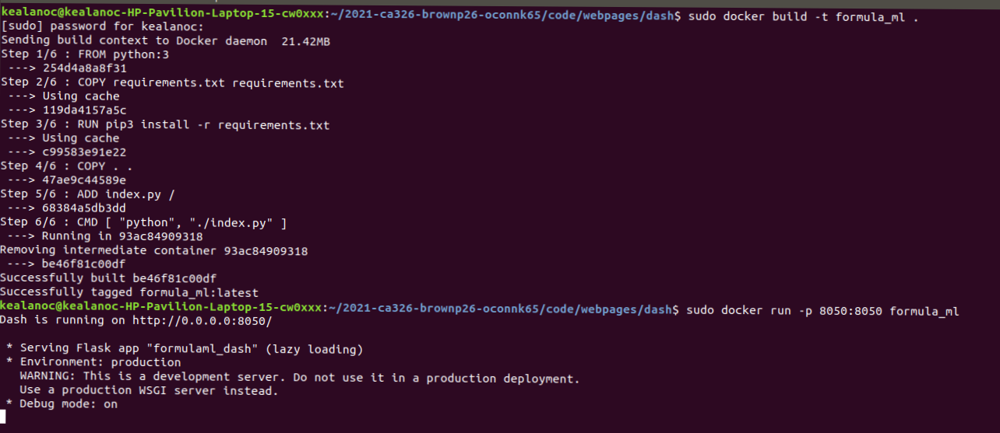

# **Technical Specification - *FormulaML***

## Group Members

  + Kealan O'Connor - 18348311
  + Peter Browne - 18424692
  

# **Table of contents**

 **1. Introduction**  
      
 - [1.1 Overview](#11-overview)
    
 - [1.2 Glossary](#12-glossary)

 **2. System Architecture**

 - [2.1 System Architecture](#21-system-architecture)

 **3. High Level Design**

 - [3.1 Context Diagram](#31-context-diagram)

 - [3.2 Data flow Diagram](#32-data-flow-diagram)

 - [3.3 Use Case Diagram](#33-use-case-diagram)

**4. Problems and Resolutions**

 - [4.1 Dash Framework](#41-dash-framework)
 
 - [4.2 Weather Data](#42-weather-data)

 - [4.3 Qualifying Data](#43-qualifying-data)
 
 - [4.4 Navigation Bar Issues](#43-navbar-issues)

**5. Installation Guide**

 - [5.1 Linux](#51-linux)

 - [5.2 Windows](#52-Windows)

**6. Automated Unit & System Tests**

 - [6.1 Unit Tests](#61-unit-tests)

 - [6.2 Training and Testing of Model](#62-training-and-testing-of-model)

 - [6.3 Heuristic Tests](#62-heurisitc-tests)

# **1. Introduction**

## 1.1 Overview

FormulaML is a web app built and developed for fans of Formula 1 who want to know more about the sport. It has data, statistics and dynamic visualisations on all the teams and drivers, along with our machine learning model which predicts the outcome of races and compares our predictions with the real race results. The site also features a writeup and review on last season’s F1 action. 

On the team information dashboards you will find a list of the team’s previous names, a review of the team’s 2020 season, a short overview of the team’s history in F1 and a list of some of the team’s top drivers from their current identity. Along with those you will find graphs showing their points from previous seasons, positions from previous seasons, percentage race participation for the team, a scatter plot detailing all of the team’s finishes over their time in F1, and the teams positions after every race in the 2020 season. Each of these graphs is interactive and dynamically generated.

On the drivers dashboards you can find a summary of the driver’s career, a list of awards won and teams driven for, as well as a review of their 2020 season, and a 2020 qualifying review. The graphs you will see show the driver’s points and championship position at the end of each of their F1 season(s), as well as a scatter plot on a driver’s finishes in their career, their points throughout the 2020 season and a graph showing the difference in qualifying times between the driver and their teammate.

We developed the web app using [Plotly Dash](https://plotly.com/dash/) Dash, which is a web development framework allowing creators to make great looking dashboards. The framework works by allowing you to make html pages(along with inline or external CSS) using python and then converting the graphs, tables and other content you make to javascript and HTML so they can be displayed on the site. It does this thanks to its React based front end that is used to translate the code from python commands to actual CSS, HTML and javascript.The react based front end is also what communicates with chart.js to allow for the graphs to be displayed. We had worked with Chart.js in our previous implementation of the site made in HTML, so we had an idea of how the graphs would operate and how to make them. The graphs provided by Dash also were a lot more inline with the general look of the site as well. 

We designed the website to be as user friendly as possible. Ensuring all text, graphs and tables are easily readable and interpretable. All colours are as they are/were on the cars, unless they had to be modified slightly to allow for easier viewing. The navigation bar is easy to read as well as the options that come in the drop down menus, allowing navigation of the web app to be simple and intuitive.

To make our prediction model we used a library called scikit-learn, it's a very efficient and robust library which gave us lots of tools to create our model and implement it. After trialling many other algorithms, the algorithm we decided was best for our app was Random Forest Regression. To create our model first we took and processed the information we needed from the Ergast API which access’ the FIA archives dating all the way back to the 1950s, into easily manageable data frames that had the information we needed on what we needed such as the race results, driver standings and constructor standings. To get other necessary information such as qualifying results, we used a web scraper based on Beautifulsoup to get the data from the F1 website. These data frames were merged into different usable processable CSV files.

We made our graphs using [Plotly Dash](https://plotly.com/dash/) Express through Dash. The people at Plotly make Dash as previously mentioned, and with Plotly Express being a part of the core components of Dash ensures simple link up between the figures and the web pages being made in Dash. The backend is managed using Dash(which itself uses Flask), and it’s callback system

## 1.2 Glossary

- **ERGAST API** : An Open-Source API used to access the FIA archives for data on Formula 1.
- **FIA** : The Federation Internationale de l'Automobile is the Official Governing Body for International motorsport.
- **Flask** : A python based web application framework.
- **Web Scraper** : An API or tool used to extract information from the HTML of a website.
- **Regression** : A statistical method that is used to determine the strength of the relationship between one varibale and a series of other variables.
- **Random Forest Regression**: A supervised learning algorithm using the ensemble learning method for regression.
- **Machine Learning:** : Machine learning is a method of data analysis that automates analytical model building. It is a branch of artificial intelligence based on the idea that systems can learn from data, identify patterns and make decisions with minimal human intervention.
- **CSV Data** : CSV is a file format used to store large amounts of tabular data, often used to store data for spreadsheets.
- **Plotly Dash** : A web framework that allows for creation of your own web dashboard or other analytics app.
- **Plotly Express**: A library made by Plotly that allows for easy creation of graphs and figures.
- **Scikit-learn**: A robust library with tools for predictive data analysis.
- **Beautifulsoup**: A Python package for parsing XML or HTML files.
- **Chart.js**: A javascript library that allows you to create great looking responsive graphs on a web app or website.
- **Qualifying**: In motor racing qualifying is the name given to the session/s that determine where a driver begins the race.
- **React.js**: An open-source front end JavaScript library for building user interfaces or UI components.
- **Driver Lineup**: Common way of phrasing the two drivers that make up a team’s driving members.

# **2. System Architecture**

## 2.1 System Architecture

Our system architecture has stayed largely inline with what we originally envisioned. The main change that has arisen between the original conception is the Flask based back end being changed due to our change in framework to make the dashboards. Technically it is still a Flask based back end as Dash has been built on Flask, which means that any Dash applications are web servers running Flask, communicating JSON packets over HTTP requests. Dash works by taking in the HTML and CSS and translating it using a React.js front-end. Dash stores it’s components as Python classes that encode the elements and values of a given React component and then serialise it as a JSON. In Dash the pages are returned on the backend by callbacks as opposed to Flask that uses a route system to execute functions when a given route is called.

The necessary data such as driver championship finishing positions and points, race finishing positions and team championship positions and points is collected from the [Ergast API](http://ergast.com/mrd/) and organised into different data frames. Some of these data frames then have additional data added from web scrapers that collect data from the Formula 1 website and individual race wiki pages. Using pandas these data frames are then made into usable and organised CSV files.

For the machine learning model we merge these data frames together to form a new huge dataframe. This new data frame is converted to a CSV as well and the machine learning model our Random Forest Regressor process’ the data and produce new CSV files, a collection of files each representing the results from an individual race and a CSV outlining feature importance which we show to our users to help them understand how the model came to its conclusions. These CSVs are then used by our web app to display all the numerical information relevant to individual drivers or teams, and the CSVs are used by our figures to display the graphical information we felt was important about the drivers. 

When it comes to the data we gathered via a web scraper, namely the qualifying data and weather information, they both had different paths to their display on the web app. The weather data was converted to CSV and merged with the rest of the CSV files mentioned in the previous paragraph. This data was used as part of our machine learning model and went towards our predictions due to the weather's large impact on Formula 1. Qualifying data was taken into a data frame and added as a part of the race result CSV file, due to the fact that qualifying position is one of the most important factors when trying to predict where a driver may finish in a given race. 

The race result CSV file also is used to produce more data frames and therefore more CSV files. From the race results we take the driver lineups that then are stored and used to display information. Driver finishes are taken and dealt with the same way, turned to a data frame then CSV and then used to display information, and finally the team finishes from a weekend are processed the same way.

- 

# **3. High Level Design**

## **3.1 Context Diagram**

- 
A context diagram displaying a high level overview of the compnents of the system and how they communitcate with eachother.
## **3.2 Data Flow Diagram**

- 
This Diagram displays the flow of data between fucntions, dataframes and API's. Due to the architecture and design of our system each level branches out with either entire or partial reliance on previous funcitons or dataframes.
## **3.3 Use Case Diagram**

- 

# **4. Problems and Resolutions**

## 4.1 Dash Framewrok

Originally the Dashboards and graphs were being made manually in HTML and Javascript and using Chart.js as our graphing framework with slight changes being made to each dashboard to make it personal to the given driver. From a design perspective this was not ideal though as it would require significant work to maintain the dashboards and keep them up to date. Our solution to this problem was a new framework called Dash. The purpose of this framework is to provide dynamic and easily constructed graphs and dashboards. Dash functions using entirely python and allows you to use any of the HTML, JavaScript or CSS commands to create a front end dashboard using only python syntax and data structures. The code is then sent to a React front end where it is translated into its respective language. This meant that every aspect of our dashboards could be dynamically generated using variables that would get data from Json files and everything even the pictures, graphs and styling could all be automated. The huge benefit of this was that in order to create a new driver or dashboard in the future, all that would be required was their data to be entered into the respective Json file and an endpoint be added in the Dash application. While this required us to change much of the architecture of our applications the benefits far outweighed the extra work involved in the adaptation.

## 4.2 Weather Data

Weather is incredibly important in Formula 1, everything in F1 depends on the weather. If the air is too hot the tyres will degrade quicker and lose grip, if it's too cold the tires may not be able to build up temperature and they won’t have any grip, and if it rains the entire outcome of the race can be completely changed as the chances of errors or crashes is increased. Due to these factors weather data is incredibly important to an accurate prediction, however [Ergast API](http://ergast.com/mrd/) does not provide any weather data in their records. To solve this issue we made a web scraper using Beautifulsoup that would extract the weather information from a race’s wikipedia pages that were provided by Ergast. The API would search through the wikipedia page for any reference to a list of predefined keywords to do with types of weather. For example “Wet”, “Rainy”, “Thundery”, “Showers” etc would all get sorted into the “Wet” category. The final categories included “wet”, “dry”, “warm”, “cold”, and “cloudy”, if an article contained one or more of these traits the respective parameters would be marked True or else False in our DataFrame.

## 4.3 Qualifying Data

In Formula 1 the qualifying structure changes all the time however until 1983 there was no standard structure for qualifying so it is difficult to find objective data to compare before that point. Due to this the [Ergast API](http://ergast.com/mrd/) data on qualifying is either inconsistent or non existent. To solve this issue, we once again used a web scraper using BeautifulSoup, this web scraper gathered qualifying result data from the Formula 1 website that has all the qualifying data from 1983. The downside to this is that our model will only be able to use data from 1983 onwards despite the fact that we have access to older data. We believe though that this will have little effect on the model as the older data becomes less relevant with time.

## 4.4 Navigation Bar Issues

Dash is a relatively new framework only seeing an official release in 2017 with the emphasis is largely on single page applications. Due to this some areas that are not largely used by the community are a little underdeveloped and it was a struggle to find resources to help us solve problems. One of these areas is navigation, the nav tag it offers is the same as a HTML5 nav tag but we didn’t want to have CSS pages for every driver and team as that would defeat the point of using the Dash framework. Luckily the solution to this issue came from an open source extension of - [Ergast API](http://ergast.com/mrd/), called Dash Bootstrap Components, which allows web designers to style their dashboard in Dash using bootstrap rather than an external stylesheet or a large amount of inline CSS.

# **5. Installation Guide**

## 5.1 Linux

To use our web app you must have Docker installed, it can be found at this link: https://www.docker.com/ 

Once Docker is installed it is a very simple process to install the web app. 

Navigate to the “dash” directory using the command line.
Enter the command: “sudo docker run -p 8050:8050 formula_ml”

- 

Once the command is entered the site should start up, you then navigate to your localhost on your browser, enjoy!

## 5.2 Windows
To use our web app you must have Docker installed, it can be found at this link: https://www.docker.com/ 

Once Docker is installed it is a very simple process to install the web app. 

Navigate to the “dash” directory using the command line.
Enter the command: “docker run -p 8050:8050 formula_ml”
Once the command is entered the site should start up.

However, If you have any issues with Docker or do not have it installed, there is another way. To use the site without Docker it is just as easy but requires more commands to be entered. 

First go to your Windows search function in the bottom left and enter “cmd”

- 

Once in the CMD screen navigate to where you have downloaded the web app. This is done by using the ‘cd’ command.

Once within the file structure of our web application, enter the following commands.
“cd code”
“cd webpages”
“cd dash”
“Python index.py”

The last command is what launches the web app. The cmd will not do anything visible for a couple of seconds. After a period of time the following will appear on your screen and will mean the app is up and operational.

- 

Navigate to your localhost on your web browser and you will see the web app, enjoy!

# **6. Automated Unit & System Tests**
## 6.1 Unit Tests
The primary focus of our testing was based around the automated testing of our API, data gathering and processing as many of the functions in the application are entirely dependent on these functioning properly. It easy to understand this level of dependency when you look at this data flow diagram:

- 

From this diagram you can see that it almost forms a tree like structure where each layer is dependent on one or more elements from the previous layer.
In order to adequately assess the depth and coverage of our tests we started by creating a document outlining all of the vital functions and their intended process and outcomes. This helped us ensure that we didn't have any major gaps in our testing.

- 

In total we have 23 Automated tests that allow for the verification and validation of each function throughout our data processing and analysis.

- 

## 6.2 Training and Testing of Model
The training and testing of our machine learning model is done at run time. It works by predicting all of the results of the previous years and cross references with the actual results in order to verify if it is correct.
The model we have used is based on a Random Forest Regression using median standard error. The weighting of hyperparameters is controlled by two parameters for the model itself, Max_features and Max_Depth. The weighting of these was decided through running the model many times using slightly different parameters each time. The chosen values as seen in the screenshot below gave us the best consistency and accuracy so they form the baseline for the model. Once the model has completed its predictions it is then scored based on the accuracy it predicted the winner of the race compared to the real data. We chose this metric as through our testing we saw that the model was more accurate for each result when the winner was predicted correctly. As you can see from the screenshot below, our model was able to predict the winner of each race in 2020 approximately 70% of the time.

- 

## 6.3 Heuristic Tests

The final method of testing and evaluation we conducted was an evaluation based on Jakob Nielsen's heuristics.[https://www.nngroup.com/articles/ten-usability-heuristics/](https://www.nngroup.com/articles/ten-usability-heuristics/)

### 6.3.1 Visibility of system status
The status of the system is always apparent to the user as the server will display its status upon launching and will inform the user if anything has gone wrong. Dash will also Notify users of any errors that may have occurred on the front-end. 

### 6.3.2 User control and freedom
The users will have complete freedom to explore and interact with any of our dashboards and graphs. The is easily navigable through our navigation bar and dropdown menus. Each graph is dynamic and allows the user to zoom in, scroll, hover for more information, select data points and also download the graph as a png.

### 6.3.3 Consistency and standards
Our app was designed with consistency in mind due to the nature of our dynamic dashboards and graphs which allows each page to be structurally the same but also have its own unique look and style via the automatic team/driver colour coding.

### 6.3.4 Error prevention
The app has been extensively tested on the backend to ensure that all data frames and functions are operating as expected. On the front-end our web framework, Dash, will inform the user of any unexpected errors that occur with an error notification and will point the use towards what exactly has gone wrong. Due to the nature of Dash and its dynamic callbacks, one error will not necessarily cripple the entire system so much of the app may be unaffected by the error.

### 6.3.5 Recognition rather than recall
As briefly touched upon in the consistency and standards section, our application offers dynamic graphs and dashboards that can change style automatically depending on the driver/team that the user is looking at. The colour schemes chosen are reflective of the drivers and the teams official colour so it is easy to tell each driver and teams association from the style alone.

# **7. Appendices**
- Ergast API
- [http://ergast.com/mrd/](http://ergast.com/mrd/)
- Flask Framework
- [https://flask.palletsprojects.com/en/1.1.x/](https://flask.palletsprojects.com/en/1.1.x/)
- F1.com
- [https://www.formula1.com/](https://www.formula1.com/)
- FIA.com
- [https://www.fia.com/](https://www.fia.com/)
- Scikit-Learn
- [https://scikit-learn.org/stable/](https://scikit-learn.org/stable/)
- Plotly-Dash
- [https://plotly.com/dash/](https://plotly.com/dash/)
